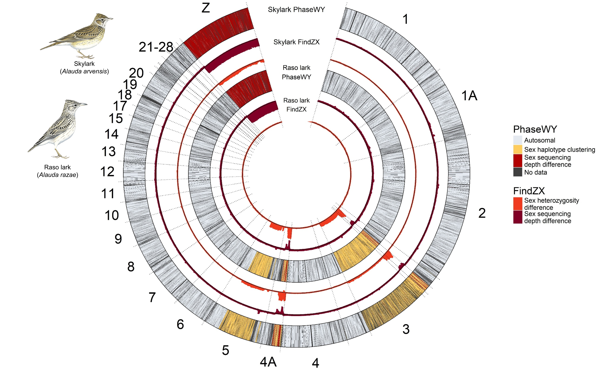

## Genomics of lark sex chromosomes

 )  

 

This repository contains scripts used to to process, analyse, and produce figures for:

Paper 1: 
**Ellerstrand, S.J., Hansson, B. 2026. *Selective regimes and evolutionary dynamics of Z and W gametologs across an expanded avian neo-sex chromosome*. Genome Biology and Evolution.**

Paper 2: 
**Ellerstrand, S.J., Brooke, M. de L., Kutschera, V.E., Hansson, B. 2026. *An enlarged neo-W chromosome maintains female functional genetic variation in the critically endangered Raso lark*. Submitted to Molecular ecology.**

Whole genome sequences are published at: 
**https://www.ncbi.nlm.nih.gov/bioproject/PRJNA1201347**

Scripts and metadata for processing raw data of can be found under Skylark_2021/ and Rasolark_2021/ for respective species.

Scripts for preperation of the reference genome and annotation liftover can be found under lift_over/.

Scripts for shared processing steps of species, analyses, and figures used in the Genome Biology and Evolution paper can be found under Analyses_paper1/.

Scripts for  analyses and figures used in the Molecular Ecology paper can be found under Analyses_paper2/.

The PhaseWY pipeline used in these papers can be found at: 
https://github.com/sjellerstrand/PhaseWY
